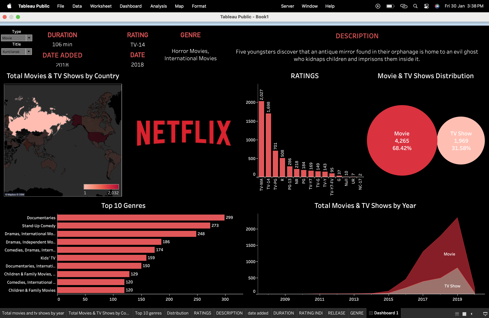

# 🎬 Netflix Movies & TV Shows Dashboard

## 📊 Interactive Data Analysis using Tableau

An interactive **Tableau Public dashboard** that explores Netflix’s global catalog of **Movies and TV Shows**.  
This project analyzes content distribution by **country, year, genre, rating, and type**, using a **Netflix-inspired dark theme** for clear storytelling.

---

## 🧭 Project Overview

This dashboard answers key questions such as:

- 🌍 How is Netflix content distributed across different countries?
- 🎥 Do Movies or TV Shows dominate the platform?
- 🏷 Which genres are most common on Netflix?
- 📈 How has Netflix’s content grown over time?
- 🔞 Which maturity ratings appear most frequently?

---

## 📊 Dashboard Highlights

### 🔹 Key Information Panel
- Type (Movie / TV Show)
- Title
- Duration
- Rating
- Genre
- Release Year
- Date Added
- Description

### 🔹 Visualizations Included
- 🌍 **World Map** – Total Movies & TV Shows by Country  
- 📊 **Bar Chart** – Ratings Distribution (TV-MA, TV-14, PG-13, etc.)  
- 🔴 **Bubble Chart** – Movie vs TV Show Distribution  
- 📈 **Area Chart** – Total Titles Added by Year  
- 📋 **Horizontal Bar Chart** – Top 10 Genres on Netflix  

---

## 🧠 Key Insights

- 🎬 **Movies dominate Netflix’s library** (~68%), while TV Shows account for ~32%
- 🔞 **TV-MA and TV-14** are the most common ratings
- 🚀 Rapid content growth started after **2015**
- 🎤 **Documentaries and Stand-Up Comedy** are among the most frequent genres
- 🇺🇸 🇮🇳 The **United States and India** contribute significantly to Netflix’s catalog

---

## 🛠 Tools & Technologies

| Tool | Purpose |
|----|----|
| Tableau Public | Data visualization & dashboard creation |
| CSV Dataset | Data source |
| Dark Theme UI | Netflix-style design |

---

## 📂 Dataset Information

- **File Name:** `netflix_titles.csv`
- **Data Source:** Public Netflix Movies & TV Shows dataset
- **Key Columns:**
  - `type`
  - `title`
  - `country`
  - `date_added`
  - `release_year`
  - `rating`
  - `duration`
  - `listed_in` (Genre)
  - `description`

---

## 🚀 How to Use This Project

1. Download the dataset: `netflix_titles.csv`
2. Open **Tableau Public**
3. Connect Tableau to the CSV file
4. Open or recreate the dashboard
5. Use filters to explore content by **country, year, genre, and type**

---

## 📸 Dashboard Preview

---

## 🔮 Future Enhancements

- Country-wise trend analysis
- Genre growth over time
- Average duration analysis
- Content recommendation insights

---

## 📜 License

This project is created for **educational and analytical purposes only**.  
All data belongs to its respective sources.

---

⭐ If you find this project useful, consider giving it a star!
